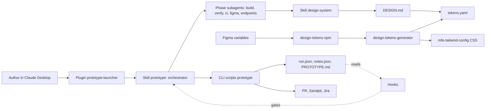

# Prototyping kit

```mermaid
flowchart LR
  A[Author in Claude Desktop] --> P[Plugin prototype-launcher]
  P --> S[Skill prototype: orchestrator]
  S --> SA[Phase subagents: build, verify, ci, figma, endpoints]
  S --> CLI[CLI scripts prototype]
  SA --> DS[Skill design-system]
  DS --> MD[DESIGN.md]
  MD --> TY[tokens.yaml]
  F[Figma variables] --> NPM[design-tokens npm] --> GEN[design-tokens-generator] --> TY
  GEN --> CSS[mfe-tailwind-config CSS]
  H[Hooks] -.gates.-> S
  RJ -.reads.-> H
  CLI --> RJ[run.json, notes.json, PROTOTYPE.md]
  CLI --> OUT[PR, Sandpit, Jira]
```
