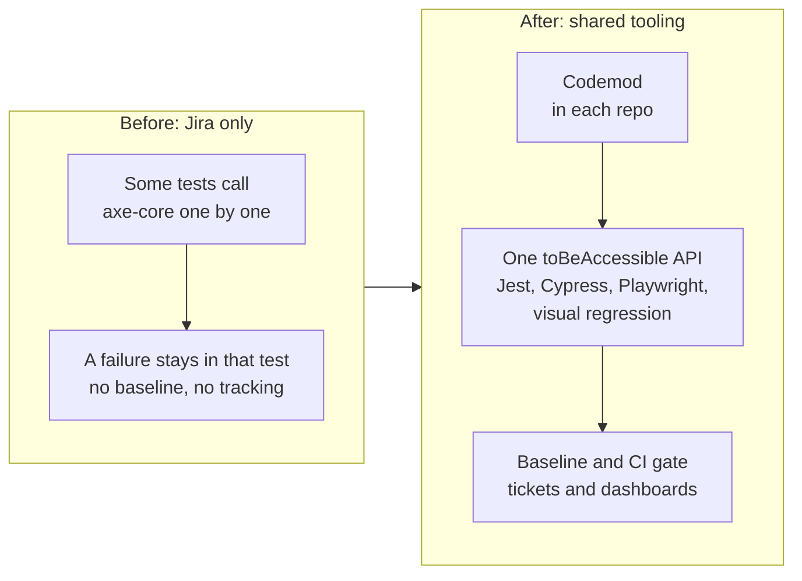
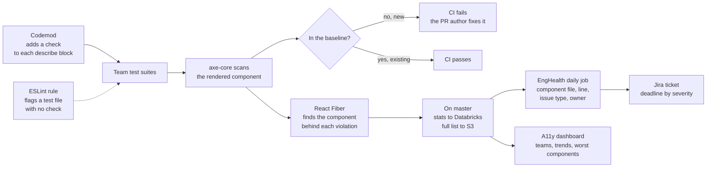
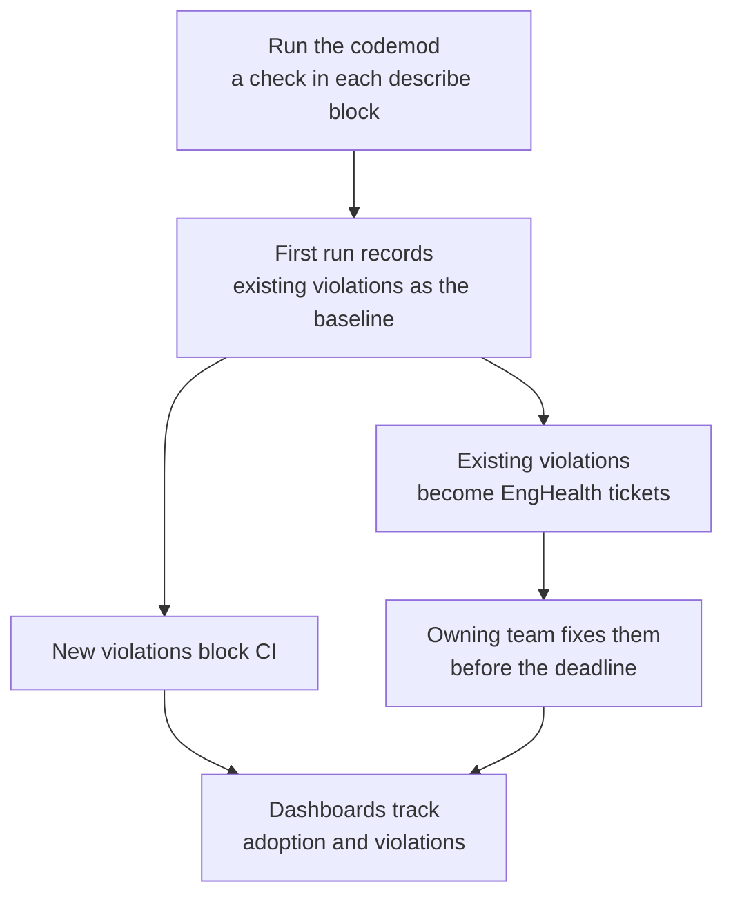

# Accessibility tooling

[Back to all projects](../README.md)

The reasoning behind the main choices is in [design-notes.md](./design-notes.md).

A codemod added an accessibility check to the tests teams already had. A new
violation fails CI. An existing one becomes a Jira ticket with a deadline.

## Problem

- **Accessibility wasn't enforced.** Nothing stopped a PR from adding a new
  violation.
- **Jira had only a start.** Some Jira tests called axe-core one by one. There
  was no shared API, baseline, tracking or dashboard.
- **Teams used different test frameworks.** Jest, Cypress, Playwright and
  Playwright visual regression each needed their own setup.
- **Old violations blocked a strict check.** A hard gate would have failed lots
  of tests on day one.
- **No one saw the size of the debt.** There was no count per team and no owner
  for a fix.

## Context

- **Atlassian frontend.** Many product teams, each with test suites that
  already gate CI.
- **axe-core.** An open source engine that scans rendered HTML for
  accessibility rule violations.
- **EngHealth.** An internal tool that already existed. It maps a failure to a
  place in the code and a Jira ticket for the owning team.
- **The ask.** Measure how compliant the products are and give teams a way to
  improve.

## My ownership

- **Team lead.** I led 4 engineers and owned delivery.
- **Technical direction.** I brought design proposals with trade-offs. A
  principal engineer reviewed the big calls, and a RACI matrix set who decides
  what.
- **Rollout.** I ran rollout and communication with the consuming teams.

## Architecture

The starting point and the result:

What happens on each test run:

How a repo comes on board:

## Decisions

- **Tests as the gate.** Tests already ran on every PR and already blocked CI.
  The check joined a gate teams already trusted.
- **A codemod does the adoption.** It added a check to each `describe` block
  and reused the block's setup. Teams wrote no tests, so adoption was a
  migration.
- **Baseline, then block new.** Old violations don't fail the build. A new one
  does.
- **One API, framework idioms.** `toBeAccessible` reads the same everywhere. Each
  framework keeps its own way to render.
- **Attribute to the component.** React Fiber leads from the failing DOM node to
  the component that rendered it. EngHealth gets that component's file and
  owner. A design system bug seen in many tests becomes one ticket for the
  design system team.

## Trade-offs

- **The baseline** lets the gate go on and stay on. Old debt shrinks slower.
- **Tests over a crawler on the live site.** A crawler finds a problem after
  release. A test finds it in the PR that adds it. A crawler reaches a dialog
  only if someone scripts the clicks. Tests already make those clicks. The cost:
  a component with no test is invisible to the check.
- **axe-core finds part of WCAG.** It can't judge reading order, error text or
  keyboard flow. It is the automated floor.
- **Each scan costs CI time.** At this scale the extra minutes add up.
- **Deadlines for old debt.** A PR author is blocked only for what their PR
  adds. The owning team fixes the rest.

## Delivery

1. **Move to the platform.** A shared axe-core wrapper takes a
   `violationsBaseline` list and fails a test on anything new. Each framework
   registers its matcher with one call. Playwright and visual regression got
   new matchers, and exemptions got a schema and API.
2. **Codemods.** They added a check to each `describe` block, ran it and
   recorded the baseline. The setup came from `beforeEach` or from the first
   test up to its first real assertion after a wait.
3. **Pilot.** The codemod ran on pilot packages before the rest.
4. **Enforce.** A warning ESLint rule flags a test file with no check. A
   package not on board yet gets a suppression. Each suppression gets an
   EngHealth ticket.
5. **Track.** On master the wrapper sends stats to Databricks and the full list
   to S3. A daily job passes the list to EngHealth. EngHealth files tickets for
   the owning team.

## Risk

- **False alarms kill trust.** A moved violation counted as new fails a PR
  unfairly. Baseline matching had to survive refactors.
- **Teams switching the check off.** A green day one gave them little reason
  to.
- **Skipping the check.** The ESLint rule flags test files that leave it out.
- **Flaky scans.** In Playwright, color contrast failed at random while CSS
  transitions were still running. The check now waits for animations to end.

## Validation

- **A11y dashboard.** Daily reports from Databricks. It shows each team's
  violations over time, the error types and the components that need the most
  work.
- **EngHealth.** Tickets closed against their deadline.
- **The limit.** A violation count is a proxy. Proof of a better experience
  needs an audit or fewer user complaints.

## Metrics

How success is measured:

- **Adoption.** Teams and repos on board, share of test files with the check.
- **Debt.** Violations in the first baseline against today.
- **Gate.** PRs stopped by a new violation.
- **Remediation.** Tickets closed before their deadline.

## Failure

- **I leaned on the principal engineer too much.** Early on I brought him many
  small decisions. His feedback: work more on my own and own the project.
- **What changed.** I started bringing a proposal with trade-offs instead of a
  question. We wrote a RACI matrix, and talks moved to the key decisions only.

## Lessons

- **Use the gate teams already trust.** Extending tests got adopted. A new tool
  would have needed selling.
- **Block only what a PR adds.** Old debt goes to the team that owns it.
- **Automate adoption.** A codemod beats asking teams to write tests.
- **Bring a proposal.** A lead who brings options and a pick moves faster than
  one who asks.
- **A count is a proxy.** Fewer axe violations is an early signal. Real proof
  needs audits or user reports.
