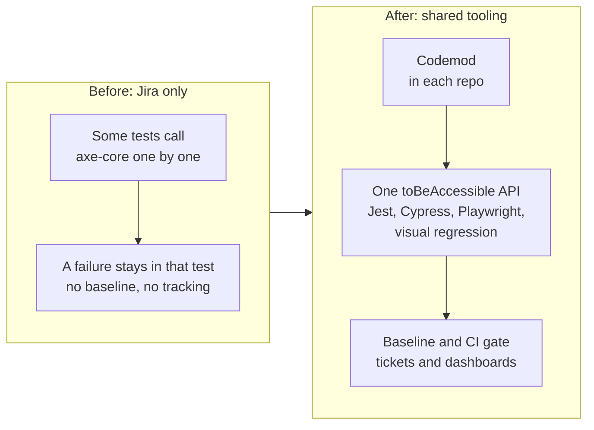
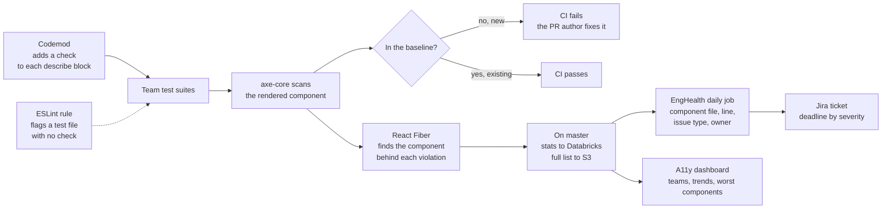
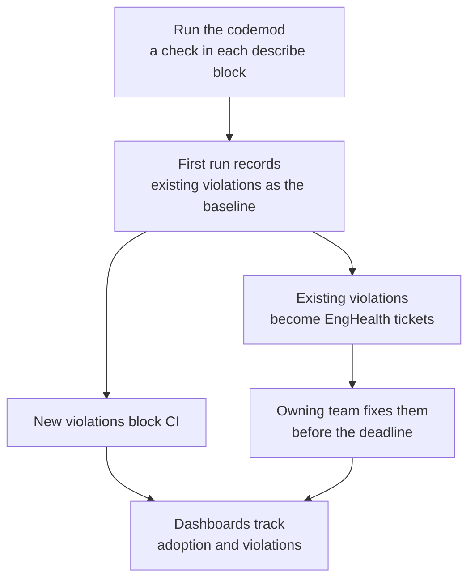

# Accessibility tooling

[Back to all projects](../README.md)

The reasoning behind the main choices is in [design-notes.md](./design-notes.md).

A codemod added an accessibility check to the tests teams already had. A new
violation fails CI. An existing one becomes a Jira ticket with a deadline.

## Problem

- **Accessibility wasn't enforced.** Nothing stopped a PR from adding a new
  violation.
- **Jira had only a start.** Some Jira tests called axe-core one by one. There
  was no shared API, baseline, tracking or dashboard.
- **Teams used different test frameworks.** Jest, Cypress, Playwright and
  Playwright visual regression each needed their own setup.
- **Old violations blocked a strict check.** A hard gate would have failed lots
  of tests on day one.
- **No one saw the size of the debt.** There was no count per team and no owner
  for a fix.

## Context

- **Atlassian frontend.** Many product teams, each with test suites that
  already gate CI.
- **axe-core.** An open source engine that scans rendered HTML for
  accessibility rule violations.
- **EngHealth.** An internal tool that already existed. It maps a failure to a
  place in the code and a Jira ticket for the owning team.
- **The ask.** Measure how compliant the products are and give teams a way to
  improve.

## My ownership

- **Team lead.** I led 4 engineers and owned delivery.
- **Technical direction.** I brought design proposals with trade-offs. A
  principal engineer reviewed the big calls, and a RACI matrix set who decides
  what.
- **Rollout.** I ran rollout and communication with the consuming teams.

## Architecture

The starting point and the result:

What happens on each test run:

How a repo comes on board:

## Decisions

- **Tests as the gate.** Tests already ran on every PR and already blocked CI.
  The check joined a gate teams already trusted.
- **A codemod does the adoption.** It added a check to each `describe` block
  and reused the block's setup. Teams wrote no tests, so adoption was a
  migration.
- **Baseline, then block new.** Old violations don't fail the build. A new one
  does.
- **One API, framework idioms.** `toBeAccessible` reads the same everywhere. Each
  framework keeps its own way to render.
- **Attribute to the component.** React Fiber leads from the failing DOM node to
  the component that rendered it. EngHealth gets that component's file and
  owner. A design system bug seen in many tests becomes one ticket for the
  design system team.

## Trade-offs

- **Tests over ESLint `jsx-a11y` and over a crawler on the live site.** ESLint
  reads source code and misses ARIA set at runtime. A crawler finds a problem
  after release and misses states behind clicks. A test finds it in the PR
  that adds it. The cost: a component with no test is invisible to the check.
  Each scan also adds CI time.
- **A baseline over failing on every old violation.** The gate goes on and
  stays on. A PR author is blocked only for what their PR adds. The cost: old
  debt shrinks slower. The owning team fixes it by a deadline.
- **axe-core over a manual audit.** axe-core runs on every PR. A manual audit
  doesn't scale and runs only when someone remembers. The cost: axe-core finds
  part of WCAG. It can't judge reading order, error text or keyboard flow.

## Delivery

1. **Move to the platform.** A shared axe-core wrapper takes a
   `violationsBaseline` list and fails a test on anything new. Each framework
   registers its matcher with one call. Playwright and visual regression got
   new matchers, and exemptions got a schema and API.
2. **Codemods.** They added a check to each `describe` block, ran it and
   recorded the baseline. The setup came from `beforeEach` or from the first
   test up to its first real assertion after a wait.
3. **Pilot.** The codemod ran on pilot packages before the rest.
4. **Enforce.** A warning ESLint rule flags a test file with no check. A
   package not on board yet gets a suppression. Each suppression gets an
   EngHealth ticket.
5. **Track.** On master the wrapper sends stats to Databricks and the full list
   to S3. A daily job passes the list to EngHealth. EngHealth files tickets for
   the owning team.

## Risk

- **False alarms kill trust.** A moved violation counted as new fails a PR
  unfairly. Baseline matching had to survive refactors.
- **Teams deleting the check.** If the new check had failed lots of builds on
  the first day, teams would delete it or skip it to get CI green again. The
  baseline lets every build pass on the first day, so teams keep the check.
- **Skipping the check.** The ESLint rule flags test files that leave it out.
- **Flaky scans.** In Playwright, color contrast failed at random while CSS
  transitions were still running. The check now waits for animations to end.

## Validation

- **A11y dashboard.** Daily reports from Databricks. It shows each team's
  violations over time, the error types and the components that need the most
  work.
- **EngHealth.** Tickets closed against their deadline.
- **What the dashboards can't show.** They count what axe-core finds. Whether
  the product got easier for keyboard and screen reader users needs a manual
  audit or user reports.

## Metrics

How success is measured:

- **Adoption.** Teams and repos on board, share of test files with the check.
- **Debt.** Violations in the first baseline against today.
- **Gate.** PRs stopped by a new violation.
- **Remediation.** Tickets closed before their deadline.

## Failure

- **Decision rights were unclear at the start.** The scope was still open.
  Small calls went to the principal engineer along with the big ones, and that
  slowed the team.
- **The fix.** We wrote a RACI matrix together. I owned the day-to-day calls
  and brought him the key decisions with options and a pick.
- **The result.** Decisions moved faster, and his time went to the calls that
  needed it.

## Lessons

- **Use the gate teams already trust.** Extending tests got adopted. A new tool
  would have needed selling.
- **Block only what a PR adds.** Old debt goes to the team that owns it.
- **Automate adoption.** A codemod beats asking teams to write tests.
- **Bring a proposal.** A lead who brings options and a pick moves faster than
  one who asks.
- **Fewer violations is a first sign.** Proof that real users have it easier
  needs an audit or user reports.
