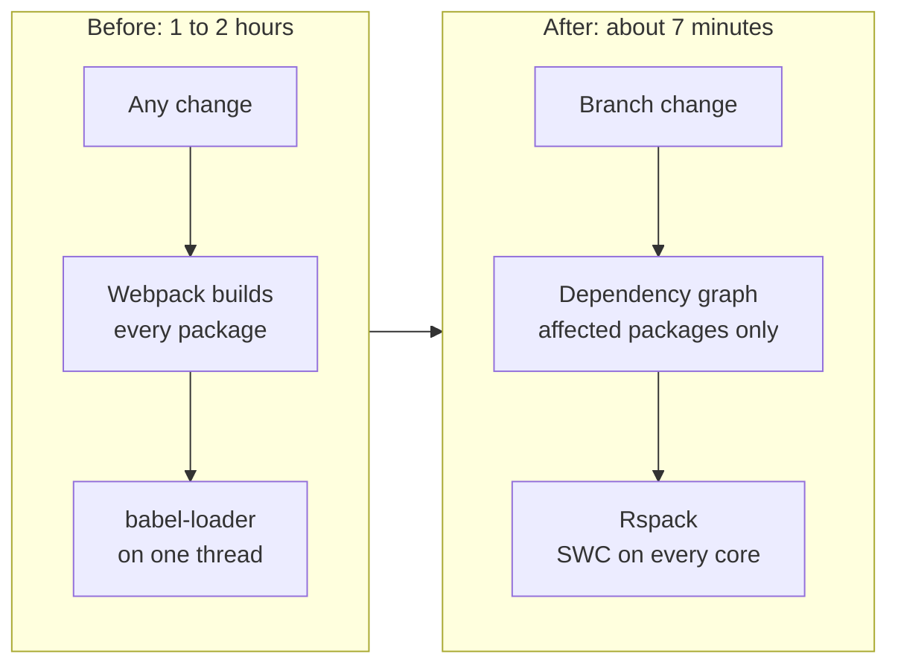
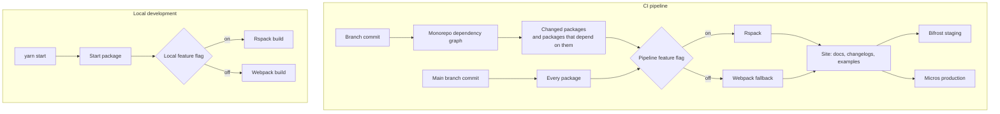
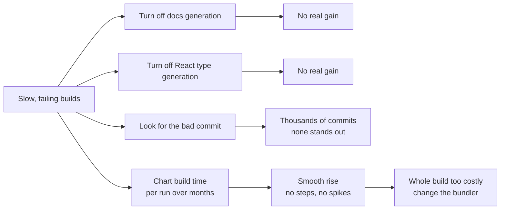

# Build pipeline optimisation

[Back to all projects](../README.md)

The reasoning behind the main choices is in [design-notes.md](./design-notes.md).

The Atlaskit website build dropped from 1 to 2 hours to about 7 minutes. I
moved it from Webpack to Rspack and made branch builds compile only the
packages a change touches. CI costs fell by about US$45,000 a quarter.

## Problem

- **Builds took 1 to 2 hours.** The website build had slowed down over several
  months.
- **Builds hit CI limits.** Long runs timed out and failed now and then. A
  failed build blocked the branch until someone ran it again.
- **Every platform change waited on it.** The build was required for any
  commit that touched a platform package.
- **Costs grew.** CI minutes cost money, and engineers sat waiting for
  feedback.
- **No team owned it.** The failures annoyed many teams. None of them was
  assigned to fix them.

## Context

- **Atlaskit website.** It shows docs, changelogs and live examples for every
  package in the design system monorepo of React and TypeScript packages.
- **A fast-growing design system.** Teams were adding new components and
  several large packages.
- **Webpack.** It bundled the site and used `babel-loader` to transpile code.
- **Two hosts.** Bifrost serves staging and Micros serves production. Each
  needs its own build settings.
- **Rspack.** A bundler written in Rust that reads Webpack config. Other teams
  in the company already used it.

## My ownership

- **Self-started.** The build was outside my main project. I saw the
  recurring failures and took the problem on.
- **Side project.** I timeboxed it. It had to fit around the deadlines of my
  main project.
- **Hands on.** I did the investigation, the migration, the selective builds
  and the rollout.
- **Engineers as customers.** The people who gained were frontend engineers
  waiting on branch builds.

## Architecture

The starting point and the result:

How a build picks its packages and its bundler, in CI and on a laptop:

How the investigation found the cause:

## Decisions

- **Chart the build first.** I added a chart of build time per run. It rose
  smoothly with no steps or spikes. A bad commit leaves a step, and flaky CI
  leaves spikes. A smooth rise points at the size of the build.
- **Rspack as the bundler.** It runs in Rust on every CPU core with no garbage
  collector. Its built-in SWC loader transpiles about 20 times faster than
  `babel-loader`.
- **Rspack over Vite.** Rspack reads the Webpack config and runs most Webpack
  loaders and plugins. The first working build took a couple of days. Vite
  would have meant rewriting the config and replacing every plugin.
- **Selective branch builds.** A branch builds only the packages it changes
  and the packages that depend on them. Build time follows the size of the
  change.
- **Feature flags on CI and local builds.** The pipeline flag picks Rspack or
  Webpack in CI. On a laptop `yarn start` calls a start package. The package
  reads a separate flag and runs the Rspack or the Webpack build. Turning a
  flag off brings the old build back in one step.

## Trade-offs

- **Rspack supports most Webpack plugins.** Each plugin in the config had to
  be checked against its compatibility list.
- **SWC replaces Babel.** A custom Babel plugin has no SWC twin and needs
  another path.
- **A branch build shows part of the site.** Reviewers see the changed
  packages and their dependents. Main builds the rest.
- **The dependency graph must be right.** A missing dependency leaves a page
  out of the branch build. The full build on main still catches it.
- **Two pipelines for a while.** Webpack stays as a fallback until Rspack
  proves itself, and both need upkeep.

## Delivery

1. **Stop the bleeding.** When failures got too frequent, I switched the
   pipeline off to unblock branches.
2. **Investigate.** I turned off costly steps one at a time. Then I charted
   build time per run over months.
3. **Migrate.** I moved the Webpack config to Rspack. The first working build
   took a couple of days.
4. **Selective builds.** I fed the monorepo dependency graph into branch
   builds.
5. **Validate and roll out.** I handled the Bifrost and Micros differences and
   compared the output with the Webpack build. Then the flag went on step by
   step.

All of it fit around the deadlines of my main project.

## Risk

- **Different output.** Rspack could build a site that differs from the
  Webpack one. I compared the output before switching.
- **Host differences.** Bifrost and Micros need different settings. The
  pipeline handles each one.
- **A bad switch.** The flag brings Webpack back in one step.
- **Pages missing from branch builds.** Main still builds the whole site.
- **Time.** A side project can eat into the main one. The timebox kept it in
  check.

## Validation

- **Build time chart.** The chart that found the trend also showed the drop.
- **Output comparison.** Rspack output against Webpack output, for both hosts.
- **Gradual rollout.** The flag went on step by step with Webpack ready.
- **CI failures.** Timeouts and failed builds were watched after the switch.

## Metrics

| Metric | Before | After |
| --- | --- | --- |
| Build time | 1 to 2 hours | About 7 minutes, around 95% less |
| CI cost | Growing with build time | About US$45,000 less per quarter, US$180,000 a year |
| Recurring CI failures | Frequent timeouts | Gone |

## Failure

- **I hunted for one bad step first.** I turned off docs generation, then
  React type generation. Neither made a real difference.
- **Finding the bad commit was hopeless.** Thousands of commits had landed in
  those months.
- **The chart settled it.** Build time rose smoothly over months. That shape
  rules out a single bad change.
- **The cost.** The step tests took time the chart would have saved.

## Lessons

- **Chart the trend before hunting a cause.** A step, a spike and a smooth
  rise each point at a different cause.
- **Pick the tool you can ship.** A Webpack-compatible bundler fit the
  timebox. A Vite rewrite did not.
- **Cut the cost per module and the number of modules.** Rspack did the first
  and selective builds did the second. Together they gave the 95%.
- **Flag infrastructure changes too.** The fallback made the switch safe to
  try.
- **Shared pain needs an owner.** The build slowed for months with no team
  watching it.
