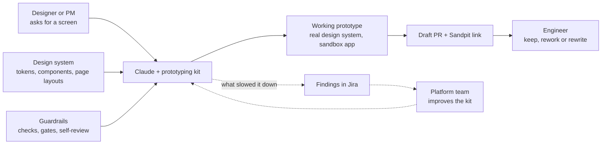
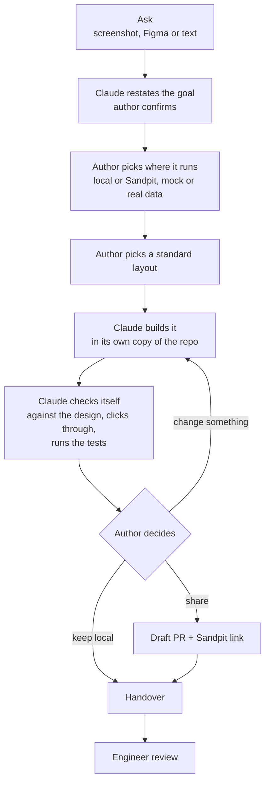
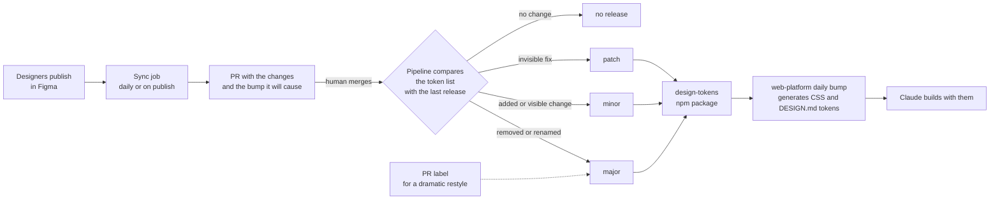

# Prototyping kit

[Back to all projects](../README.md)

The full architecture, phase by phase, is in [detailed.md](./detailed.md).

A designer or PM asks Claude for a screen. The kit builds a working prototype
from the real design system, checks it, and shares a link. An engineer can lift
the code instead of starting from scratch.

## Problem

- **Prototypes got thrown away.** Figma mockups and AI demos looked right, but
  engineers rebuilt every screen from scratch.
- **Designers couldn't build in code.** The repo needs a dev setup, Node, git
  and knowledge of the design system.
- **An AI agent alone drifts.** It made up colours, skipped steps and stopped
  halfway.
- **Tokens drifted from Figma.** web-platform held hand-copied CSS, and a
  person guessed each package version.

## Context

- **Mitti design system.** Figma tokens, the `shift-ui` components and
  standard page layouts.
- **web-platform.** A monorepo of micro-frontends with a sandbox app for
  experiments, deployed to Sandpit, the test copy of the product.
- **Authors.** Designers and PMs on a Mac with Claude Desktop, most with no
  terminal experience.
- **Tokens.** One npm package fed both web apps, still shipping a legacy set
  next to Mitti.

## My ownership

- **Prototyping kit.** I designed and built it end to end: the Claude skill,
  the CLI, the hooks, the launcher plugin and the author runbook.
- **Design system for agents.** I wrote `DESIGN.md` and the design-system skill
  so an agent can follow the rules.
- **Tokens rework.** I wrote the ADR and built the generator that turns the
  package into web-platform CSS.

## Architecture

The author answers a few questions. Claude does the rest and pings the Mac
whenever it needs them.

Figma changes reach the code with no one copying values or guessing a version.

## Decisions

- **Sandbox only.** Every prototype is a page in the sandbox app, on its own
  unmerged branch.
- **Code over prompts.** When the agent got a step wrong twice, the step moved
  from instructions into a script.
- **One subagent per phase.** Build, verify and CI each run in a fresh context
  with their own rules.
- **The design system wins.** A colour the system lacks snaps to the nearest
  token, and Claude tells the author.
- **The machine picks the token version.** The pipeline diffs the token list
  against the last release. Visible changes are minor, removals are major.

## Trade-offs

- **The sandbox over product apps.**
  - **Why:** prototype code stays out of product apps.
  - **Gave up:** a prototype in a product app runs with real data and real
    navigation. It can grow into the feature. From the sandbox, moving it
    stays engineering work.
- **Scripts over instructions.**
  - **Why:** a script behaves the same every run.
  - **Gave up:** an instruction changes in one line. The agent also bends it
    to fit an odd case.
- **A subagent per phase over one long session.**
  - **Why:** each phase runs in a fresh context with its own rules.
  - **Gave up:** one session is faster and spends fewer tokens. It remembers
    what earlier phases learned.
- **Minor over major for visible changes.**
  - **Why:** apps get restyles without a major upgrade.
  - **Gave up:** a major warns an app before its look changes. Apps that need
    pixel stability pin exact versions.
- **Automatic versioning over a person picking the version.**
  - **Why:** the pipeline diffs the token list against the last release.
  - **Gave up:** a person judges how dramatic a restyle is. A PR label lets a
    person escalate to major.

## Delivery

- **Small PRs.** The kit grew from a first workflow PR on 9 September into the
  full run in about a month. Each change has its own ticket.
- **Dogfooding.** Real prototypes ran through the kit, and their findings set
  what came next.
- **Distribution.** A Claude plugin installs in two commands, and a runbook in
  Confluence walks authors through each step.
- **Tokens in phases.** The ADR splits the rework so each phase ships alone:
  generator first, legacy removal once both apps migrated, then automatic
  versioning before automatic Figma sync.

## Risk

- **A prototype reaching production.** The branch is not for merging, and its
  PR title check stays red on purpose.
- **Credentials.** The author signs in to Sandpit and Atlassian themselves. The
  kit holds no passwords.
- **Breaking token consumers.** Removing legacy tokens ships as one major, after
  both web apps have a migration ready.
- **Figma outages.** Downloads land as commits, so a release builds the same
  output with Figma down.

## Validation

- **Against the design.** Claude puts its screenshot next to the input and
  fixes differences until they match.
- **Like product code.** Typecheck, lint, tests and i18n checks run locally and
  again in CI.
- **By an engineer.** Each part of a prototype gets keep, rework or rewrite on
  the PR.
- **Tokens.** CI fails when someone edits generated CSS by hand. The PR shows the
  token diff and the version it will cause.

## Metrics

Success means designers and PMs ship working prototypes, and engineers keep the
code.

| Signal | Good looks like | Why |
| --- | --- | --- |
| Prototypes and their authors | Both grow, with designers and PMs among the authors | People with no dev setup build in code |
| Time from ask to Sandpit link | Minutes. The build step takes 5 to 20 | Ideas are cheap to try |
| Prototype parts engineers rate keep | A growing share | Engineers stop rebuilding screens from scratch |
| Findings filed per run | Fall over time | The kit gets fewer things wrong |
| Findings fixed | Most of them | A problem gets fixed once, in the kit |

## Failure

- **The agent stopped mid-run.** Authors thought it was done. A hook now blocks
  the stop until something will wake the session.
- **Findings went missing.** Parallel filing could clobber the notes file. Each
  write now goes through a temp file and a lock.
- **Tokens drifted silently.** web-platform copied CSS by hand, and nobody saw
  Figma move on. The generator and its CI check replaced the copy.

## Lessons

- **Give the agent rails.** Free-form instructions fail quietly. A script plus
  a gate fails loudly and early.
- **Give the agent a voice.** Findings showed where the kit was weak faster
  than any review.
- **Design for the least technical user.** One question at a time, a
  notification when input is needed, no terminal past setup.
- **Keep people on judgement calls.** People merge the Figma sync, label a
  restyle and decide to publish. Code does the rest.

---

[Detailed architecture](./detailed.md) · [All projects](../README.md)
