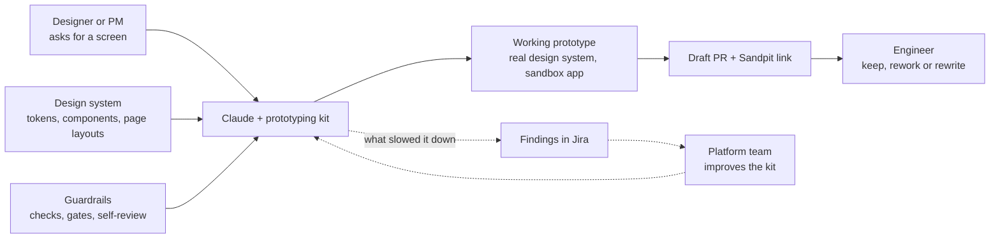
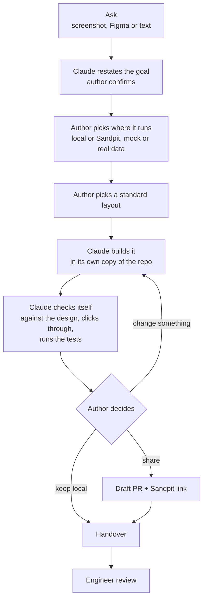
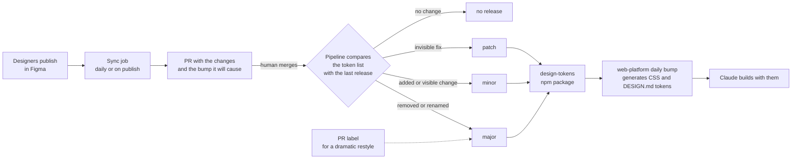

# Prototyping kit: interview notes

The full architecture, phase by phase, is in [detailed.md](./detailed.md).

## The pitch

A designer or PM asks Claude for a screen. The kit builds a working prototype
from the real design system, checks it, and shares a link. An engineer can lift
the code instead of starting from scratch.

## The big picture

## How a run goes

The author answers a few questions. Claude does the rest and pings the Mac
whenever it needs them.

## Design tokens pipeline

Figma changes reach the code with no one copying values or guessing a version.

## The story

- **Situation.** Prototypes from Figma got thrown away, and engineers rebuilt
  each screen. An AI agent left alone made up colours and stopped halfway.
- **Task.** Let a non-engineer get a prototype in production-quality code on
  the design system.
- **Action.** Put Claude on rails: one step at a time, the author approving
  each decision, and every step checked by code. Gave it the design system as
  rules it can read. Made the agent report where the kit slowed it down.
- **Action, tokens.** Replaced hand-copied CSS and hand-picked versions with a
  pipeline that syncs from Figma and picks the version itself.
- **Result.** Your numbers here: prototypes built, code engineers kept, findings
  fixed.

## Decisions I'd defend

- **Sandbox only.** A product app is another team's code and release. Moving a
  prototype there is engineering work for later.
- **Code over prompts.** When the agent got a step wrong twice, the step moved
  from instructions into a script. Scripts behave the same every run.
- **The design system wins.** A colour the system lacks snaps to the nearest
  token, and Claude tells the author.
- **The machine picks the version.** Almost every token PR is a Figma sync, so
  a person choosing patch or minor was guessing. A human label covers the one
  case code can't judge: a restyle that keeps every name.
- **Visible changes are minor.** Tokens are a visual system. A restyle shipped
  as a patch would reach apps unseen.

## Questions they may ask

- **What was hardest?** Keeping the agent going. It ended turns mid-run, so
  hooks block the stop until something will wake it.
- **How do you know the output is good?** Claude compares its screenshot with
  the design, runs the product's lint and tests, and the engineer rates each
  part keep, rework or rewrite.
- **How does it get better?** Each run files what slowed it down. The platform
  team fixes those, so the next run hits fewer walls.
- **Why not changesets for tokens?** Changesets asks a person per PR. Here the
  diff of the token list already says what changed.
