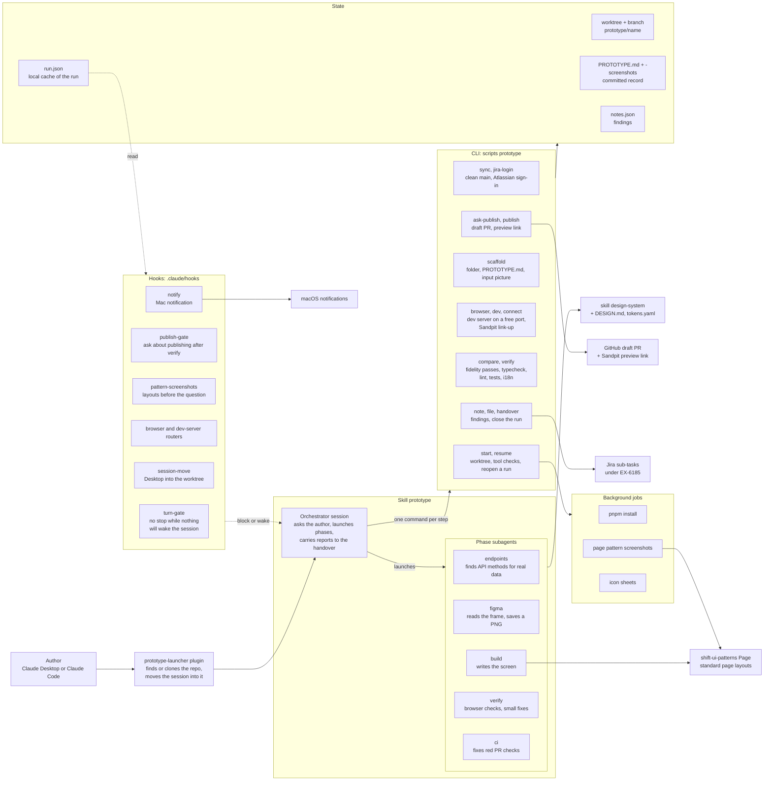
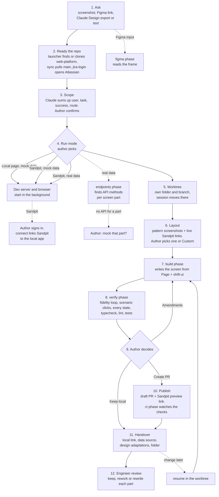
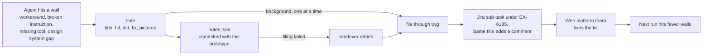
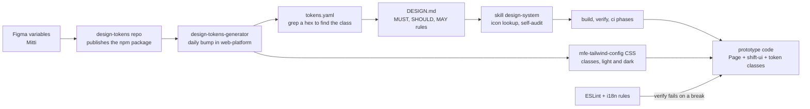

# Prototyping kit: detailed architecture

[Back to the interview notes](./README.md) · [All projects](../README.md)

An author asks Claude for a screen. The kit builds it in the sandbox app from
the real design system, checks it, and shares a draft PR with a Sandpit link.

## Architecture

The orchestrator decides, the CLI executes and keeps state, hooks stop the
model from cutting corners.

- **Worktree.** Each prototype gets its own folder and branch beside the main
  checkout, so prototypes don't mix and the main checkout stays untouched.
- **Page patterns.** Every screen is `Page` from `shift-ui-patterns`. The author
  picks a layout from screenshots before the build.
- **Notifications.** The Mac pings the author when Claude needs an answer, stops
  on an error, finishes the build, puts up the PR or ends the run.

## The run, step by step

## Self-diagnostics

The agent writes down every place the kit got in its way. The findings reach
the web platform team as Jira sub-tasks.

## Design system and tokens

