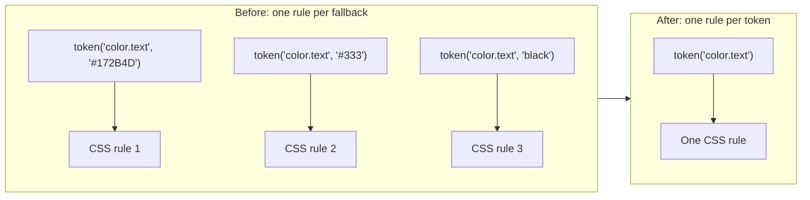
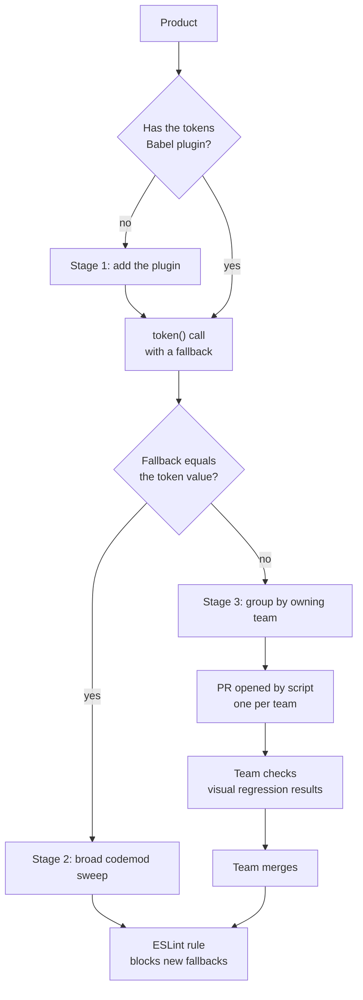

# Tokens performance

[Back to all projects](../README.md)

The reasoning behind the main choices is in [design-notes.md](./design-notes.md).

Product pages ship up to 90 KB less gzipped CSS, and LCP on core pages improved
by about 3%. I removed hard-coded fallbacks from design token calls across
several repositories. Codemods made the edits and an ESLint rule stops new
fallbacks.

## Problem

- **Every fallback made its own CSS.** Code called `token('color.text',
  '#172B4D')`. Each different fallback for the same token produced a separate
  CSS rule.
- **Most of that CSS did nothing.** In products with the tokens Babel plugin,
  the plugin ignored the hand-written fallback.
- **Some products still needed fallbacks.** Products without the Babel plugin
  depended on the fallback values.
- **No feature flag to hide behind.** The edits touched code in many products.
  A flag per edit wasn't possible, so a bad edit would reach customers.
- **Fallbacks kept coming back.** Nothing stopped an engineer from adding a new
  one.

## Context

- **Design tokens.** Named values such as `color.text`. `token()` returns a CSS
  variable, so a theme can change the colour.
- **Fallback.** The second argument of `token()`. The browser uses it when the
  theme hasn't set the variable.
- **Tokens Babel plugin.** It rewrites `token()` calls at build time. Most
  products had it, some didn't.
- **Several repositories.** The tokens package is shared. Products in other
  repositories call `token()` too.
- **Test tools.** Visual regression tests compare page screenshots. Criterion
  is the company's tool for page performance tests.

## My ownership

- **Led the migration.** I planned the stages and wrote the codemod with
  jscodeshift, a tool that edits code through its syntax tree.
- **Ran the analysis.** I compared each fallback with its token's real value.
  The result decided what the codemod could remove on its own.
- **Worked with product teams.** Each team reviewed and merged the PR for its
  own code.
- **Locked it in.** I wrote the ESLint rule that blocks new fallbacks.
- **Measured the result.** CSS analysis scripts and Criterion tests.

## Architecture

The CSS before and after:

How each `token()` call was handled:

## Decisions

- **Compare values before removing anything.** A fallback equal to its token
  value changes nothing on screen. A different one can change a colour.
- **Stages over one big run.** The Babel plugin went in first. Safe fallbacks
  went next, and risky ones last.
- **Team PRs for risky fallbacks.** A script grouped these calls by owning team
  and opened a PR for each. The team knows its own pages best.
- **An ESLint rule after the cleanup.** The rule fails lint on a new fallback.
  The CSS stays small after the migration ends.
- **Measure on real pages.** CSS size shows the bytes saved. Criterion shows
  whether people get the page faster.

## Trade-offs

- **Slower than one sweep.** Team PRs waited on each team's review.
- **Teams carry part of the work.** Each team checked its own pages.
- **Some colours change.** Where a fallback differed, the page now shows the
  token's colour. The owning team approved it.
- **Lint adds friction.** An engineer can't pass a fallback, even for a quick
  fix.
- **Visual tests cover part of the UI.** A screen without a test relies on the
  team's review.

## Delivery

1. **Analyse.** I compared every fallback with its token's value and split
   the calls into safe and risky.
2. **Add the Babel plugin.** Products that lacked it got it first.
3. **Sweep safe fallbacks.** The codemod removed fallbacks equal to the token
   value in broad runs.
4. **Team PRs for the rest.** A script grouped risky calls by owning team and
   opened the PRs.
5. **Lock it in and measure.** The ESLint rule went on. CSS analysis and
   Criterion measured the gain.

## Risk

- **No feature flag.** Each edit went straight to production. Stages, visual
  tests and team review took the place of a flag.
- **Hidden reliance on fallbacks.** Some pages showed the fallback in place of
  the token. Visual regression tests caught them.
- **Products without the plugin.** Removing their fallbacks first could break
  them. The plugin went in before any of their fallbacks went out.
- **Regrowth.** New fallbacks would bring the CSS back. The ESLint rule blocks
  them.

## Validation

- **Visual regression tests.** Screenshots before and after each stage.
- **Babel plugin checks.** Each product had the plugin before its fallbacks
  went.
- **Team review.** Each team checked and merged its own PR.
- **CSS analysis scripts.** Gzipped CSS size before and after.
- **Criterion tests.** LCP on core product pages.

## Metrics

| Metric | Result |
| --- | --- |
| CSS size | Up to 90 KB less, gzipped |
| LCP on core product pages | About 3% better |
| Broken experiences | None |

## Failure

- **I assumed a fallback was dead code wherever a theme loaded.** Visual
  regression tests showed two gaps.
- **Some products didn't use theming.** Their pages showed fallback values
  only.
- **Some kinds of tokens didn't apply.** Those always showed the fallback.
- **The cost.** Comparing values in the code wasn't enough. The plan had to
  check what each page showed too.

## Lessons

- **Check what the page shows.** The code said the fallbacks were dead. The
  screenshots said some were live.
- **Sort edits by risk.** Safe edits go in bulk. Risky ones go to the team that
  owns the code.
- **Without a flag, stage it.** Small steps with checks between them replace
  the off switch.
- **Close the door after the cleanup.** A lint rule keeps the gain.
- **Measure what people feel.** Bytes saved matter when LCP moves.
