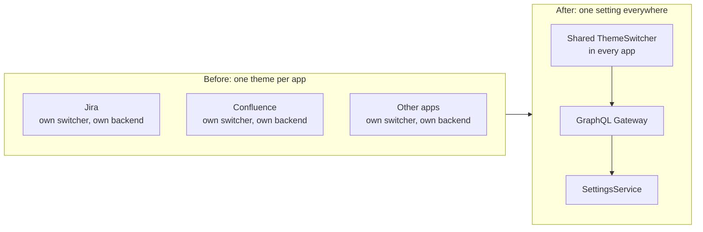
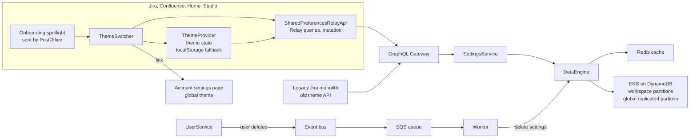
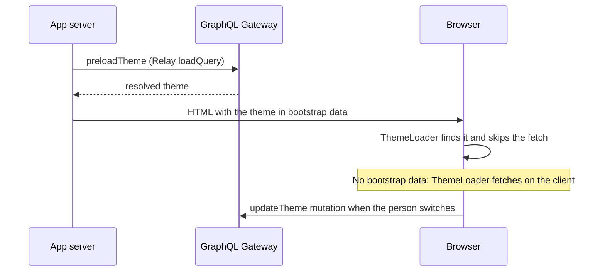

# UI Settings Platform

[Back to all projects](../README.md)

The reasoning behind the main choices is in [design-notes.md](./design-notes.md).

A person picks a theme once and every Atlassian app shows it. One backend
stores the setting. Each app loads it during server rendering, so the first
paint already has the right theme.

## Problem

- **Every app had its own theme.** Each one had its own theme switcher, theming
  code and theme backend.
- **People set the theme again and again.** A theme picked in Jira didn't reach
  Confluence or another workspace.
- **The switcher looked different in each app.** There was no shared design
  for themes and color modes.
- **The requirements were open.** Which apps, per app or per workspace, how to
  tell people about it: all of it still had to be decided.
- **The Design System team had little backend experience.** Its work had been
  frontend packages.

## Context

- **Product apps.** Jira, Confluence, Home and Studio. Each had its own SSR
  setup and its own level of GraphQL support.
- **SettingsService.** An existing Atlassian service for user settings. It
  stores data in ERS, a store built on DynamoDB, with a Redis cache in front.
- **GraphQL Gateway.** The shared GraphQL endpoint the apps call.
- **Legacy Jira monolith.** It had its own theme API and rendered some Jira
  pages by itself.
- **PostOffice.** Atlassian's in-product messaging system, used here for
  onboarding.

## My ownership

- **Feature lead.** I owned the architecture and delivery end to end.
- **Decisions with stakeholders.** I ran the data model and design decisions
  with Design System, backend, design, content and product teams.
- **Hands on.** I wrote backend code in Java and frontend code. I built the
  GraphQL API with its tests.
- **Product integration.** I used AI to write much of the integration code in
  the product codebases. Partner teams had far less to build.
- **Knowledge sharing.** I presented the design at the Regional Design Review
  and taught backend and GraphQL inside the Design System team. I mentored an
  intern who built increased contrast mode.

## Architecture

The starting point and the result:

The parts and how they connect:

How a page gets its theme:

The GraphQL operations:

| Operation | What it does |
| --- | --- |
| `getGlobalTheme`, `setGlobalTheme` | Read or write the theme for every app |
| `getResolvedTheme` | Merge the global and workspace themes. The workspace value wins |
| `updateWorkspaceTheme` | Save a workspace override without values equal to the global theme or the default |

## Decisions

- **SettingsService for storage.** It was built for settings, proven, fast,
  and easy to contribute to. Cookies, syncing the old backends and storing on
  the account were the other options.
- **A global theme with workspace overrides.** One choice reaches every app. A
  workspace can still have its own.
- **Store only what differs.** An override keeps only the values that differ
  from the global theme or the default.
- **Load the theme during SSR.** The app server puts the theme in bootstrap
  data. The page doesn't flash the wrong theme.
- **One feature flag, toggled per app.** Each app went live on its own
  schedule: dogfooding first, then a percentage rollout.

## Trade-offs

- **Global replication** keeps a copy of global settings in every region. The
  data is small, and reads stay fast everywhere.
- **The SSR preload** adds a GraphQL call to each server render. In return the
  first paint is right.
- **The localStorage fallback** shows the last known theme when the API fails.
  On a new device that is the default.
- **One serialized theme string** takes a new setting as a new key. The backend
  can't query single values inside it.
- **A flag per app** lets each team pick its pace. Old and new switchers live
  side by side for a while.

## Delivery

1. **Shape.** Requirements, scope, design decisions and backend options. Then
   the data model and a roadmap shared with product teams for feedback.
2. **Contracts first.** Data contracts and a mock API let frontend and backend
   work in parallel.
3. **Build.** Missing SettingsService features: static partitions, replication,
   deletion and account events. Then the GraphQL API, the frontend packages and
   the account settings page.
4. **Integrate.** Jira, Confluence, Home and Studio, all behind the flag.
5. **Dogfood.** The team first, then the whole company with design and
   technical blog posts. Then docs and the plan for a percentage rollout.

Dogfooding reached 100% of internal users. My part ended before the production
rollout.

## Risk

- **A slow API slows every page.** The theme is on the critical path of every
  app. A performance dashboard went up before testing started.
- **Breaking an app.** With the flag off the API calls do nothing, the old
  switcher renders and the spotlight stays hidden.
- **Data residency.** Global settings are copied across regions. The privacy
  team confirmed theme data has no residency limits.
- **Deleted users.** Settings must go with the account. A worker listens for
  user deletion events and deletes the settings.
- **Hidden scope.** The Jira monolith rendered pages outside the new code. Team
  dogfooding found them.

## Validation

- **Tests.** Unit, integration and E2E tests against real endpoints.
- **Team dogfooding.** It found the Jira monolith pages and the cross-region
  latency.
- **Operational dashboard in SignalFX.** Latency against the old API,
  throughput and errors. Alerts go to Slack and on-call.
- **Business dashboard in Databricks.** Theme on each page load, theme changes
  and onboarding views.
- **Logs in Splunk.** From the GraphQL Gateway and the backend.

## Metrics

How success is measured:

- **Adoption.** Apps with the flag on and people who changed their theme.
- **Onboarding.** Spotlight views against theme changes.
- **Latency.** Against the old theme APIs and the SLOs in every region.
- **Errors.** API error rate and alerts fired.

## Failure

- **I put global settings in one partition.** The first schema kept all global
  settings in a single partition in one region.
- **The dashboard caught it.** In team testing, US teammates got faster answers
  than AU ones.
- **The fix.** Global replication: a config change in ERS and the region passed
  in the query. Per-region storage and storage by request region lost on
  latency or consistency.
- **The result.** Fixed before company-wide dogfooding, with no data migration.
  Latency met the SLOs for every region, and the feature shipped on time.

## Lessons

- **Know where users are.** Their regions go into the architecture plan from
  the start.
- **Add observability before testing.** The dashboard found the latency before
  people outside the team did.
- **Contracts and a mock API first.** Frontend and backend moved in parallel.
- **Do the integration for partner teams.** AI made writing it in each product
  codebase cheap. Partner teams reviewed it instead of building it.
- **Agree on criteria before options.** The onboarding debate ended once design
  and engineering shared the same criteria.
